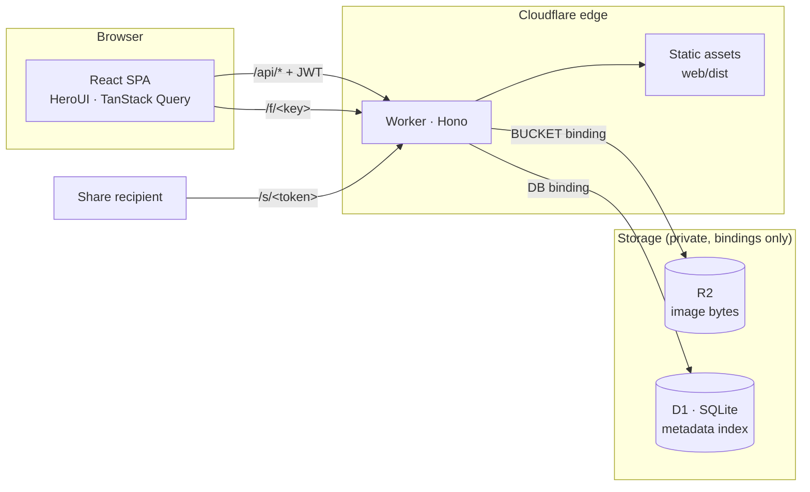
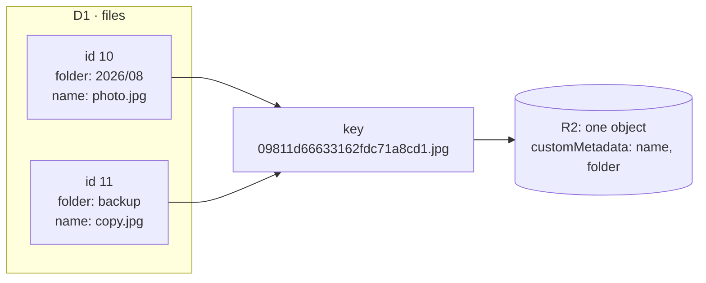
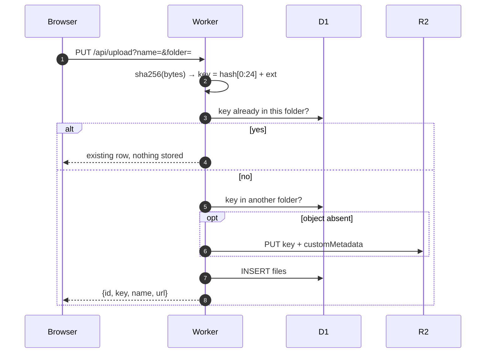
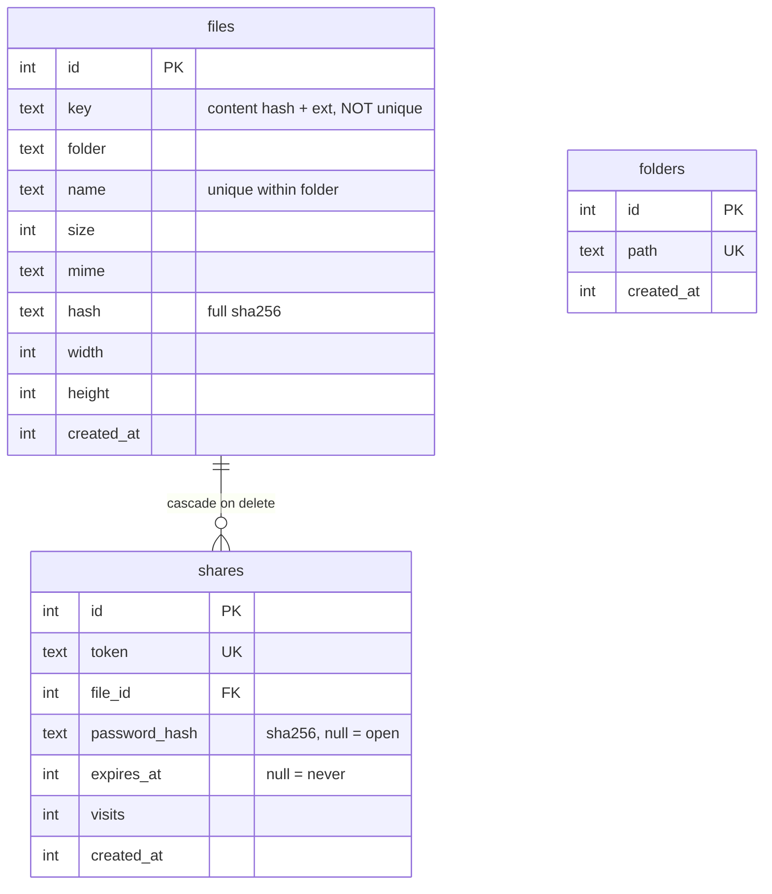

# PicNest

Self-hosted image host on Cloudflare Workers + R2 + D1.

[中文文档](README.zh-CN.md)

## Features

- Single-user password login (JWT, 7 days)
- Folders, breadcrumb navigation, move, sorting
- Drag & drop upload, multi-file, per-file progress
- Content-addressed storage with automatic deduplication
- Grid browsing, lightbox preview, file details
- Public direct links (cached one year)
- Share links with optional expiry and password; visit counts and revoke
- English / Chinese UI

## Quick start

```bash
pnpm install
cp .dev.vars.example .dev.vars   # set ADMIN_PASSWORD
pnpm dev                      # local D1 migrations + worker :8787 + vite :5173
```

Open http://localhost:5173. Vite proxies `/api`, `/f/…` and `/s/…` to the Worker.
Local D1 and R2 data live in `.wrangler/state/`.

```bash
pnpm typecheck                # worker + web
pnpm build                    # production frontend bundle
```

## Deployment

```bash
npx wrangler r2 bucket create picnest   # create the bucket
npx wrangler d1 create picnest          # create the database, paste database_id into wrangler.jsonc
pnpm db:migrate                      # migrate remote D1
pnpm secret                          # set ADMIN_PASSWORD
pnpm deploy                          # build frontend + publish Worker
```

Attach your domain to the Worker. Keep the bucket private: no `r2.dev`
subdomain, no custom domain on the bucket.

## Architecture



R2 is the source of truth; D1 is a rebuildable index (`POST /api/reconcile`).

`/api/*`, `/f/*` and `/s/*` are pinned to the Worker via `assets.run_worker_first`;
without it the SPA fallback answers browser navigations before the Worker runs.
Everything else falls through to the static assets.

### Storage rules

| Item | Rule |
| --- | --- |
| R2 object key | `SHA-256(bytes)[0:24] + ext`; the file name is not part of it |
| Key uniqueness | Not unique. Identical content = one object, many rows |
| Row identifier | `id`. Not `key` |
| Original name / folder | In D1; also written to R2 `customMetadata` for reconcile |
| Name collisions | `-2`, `-3` suffix within a folder (unique index enforces it) |
| Object deletion | Only when the reference count hits zero (`deleteFileRows`) |
| Move / rename | `UPDATE files` only; no R2 operation |
| Download filename | `Content-Disposition: inline` with `filename*=UTF-8''…` |
| Caching | `/f/` → `max-age=31536000, immutable`; `/s/` → `no-store` |
| Accepted types | `image/*` only; anything else is rejected with 415 |
| Max upload | 32 MB; larger bodies are rejected with 413 |
| Served bytes | `Content-Security-Policy: sandbox` + `X-Content-Type-Options: nosniff`, so a stored SVG cannot script this origin |
| Bucket visibility | Private, reachable only through the binding |



### Upload flow



R2 is written before D1. A failure in between leaves an unindexed object, which
reconcile claims later.

### Data model



Share pages are server-rendered and localized via `Accept-Language`.

### Security

| Surface | Control |
| --- | --- |
| Login | 5 attempts per 60s per IP, via the Workers rate limiting binding |
| Session | HS256 JWT, 7 days. The signing key is `ADMIN_PASSWORD`, so rotating the password revokes every session |
| Share password | SHA-256 in the browser; plaintext never reaches the Worker |

`ADMIN_PASSWORD` doubles as the JWT key. Use a long random one — a weak password
is also a weak HMAC key.

### Billing

Egress is free, operations are not, and bindings get no exemption. One image
view that misses cache = 1 Worker request + 1 R2 Class B operation.

| Item | Free tier |
| --- | --- |
| Storage | 10 GB |
| Class A (put / delete / list) | 1M / month |
| Class B (get / head) | 10M / month |
| Egress | Unlimited |
| Worker requests | 100k / day free; 10M / month paid |

## Stack

| Layer | Choice |
| --- | --- |
| Runtime | Cloudflare Workers · R2 · D1 |
| Backend | [Hono](https://hono.dev) · [Drizzle ORM](https://orm.drizzle.team) · hono/jwt · zod + @hono/zod-validator · nanoid |
| Frontend | React 19 · React Router 7 · TypeScript · Vite |
| UI | [HeroUI v3](https://heroui.com) · Tailwind CSS 4 · lucide-react |
| Data layer | TanStack Query · axios · zustand persist |
| i18n | i18next + react-i18next |
| Forms | react-hook-form + zod |

## Directory layout

```
picnest/
├── wrangler.jsonc           # Worker config (R2 + D1 bindings, rate limit, SPA assets)
├── pnpm-workspace.yaml      # Workspace root; `web` is the only package
├── migrations/              # SQL migrations generated by drizzle-kit
├── drizzle.config.ts
├── worker/src/
│   ├── index.ts             # App assembly, 404/error fallbacks
│   ├── config.ts            # Constants
│   ├── types.ts             # Bindings
│   ├── db/                  # Drizzle schema + client
│   ├── lib/                 # auth · files (refcount delete) · paths · r2 · hash · locale
│   ├── routes/              # auth / files / folders / shares / system
│   └── templates/           # Server-rendered share pages
├── web/public/logo.svg      # App mark; also the favicon and the share-page icon
└── web/src/
    ├── main.tsx             # Router / QueryClient / i18n / Toast assembly
    ├── i18n/                # i18next setup + en/zh locales
    ├── pages/               # LoginPage · DashboardPage
    ├── components/          # Dropzone · FileCard · FolderCard · Breadcrumb · dialogs
    ├── hooks/               # useUploads queue
    ├── lib/                 # axios client · utils
    └── store/               # zustand auth / prefs
```

## API

Authenticated endpoints require `Authorization: Bearer <jwt>`. Files are
addressed by `id`.

| Method | Path | Description | Auth |
| --- | --- | --- | --- |
| POST | `/api/login` | `{password}` → `{token}` | - |
| GET | `/api/list?folder=` | Folder contents + global stats | ✓ |
| PUT | `/api/upload?name=&folder=` | Raw bytes as body; dedups by content | ✓ |
| PATCH | `/api/file` | `{id, folder?, name?}` — move / rename | ✓ |
| DELETE | `/api/file?id=` | Delete one file (refcounted) | ✓ |
| GET | `/api/folders` | Every folder path | ✓ |
| POST | `/api/folder` | `{path}` — create (idempotent) | ✓ |
| DELETE | `/api/folder?path=` | Delete folder recursively | ✓ |
| POST | `/api/share` | `{id, hours?, password?}` → `{url, exp}` | ✓ |
| GET | `/api/shares` | Shares with visit counts | ✓ |
| DELETE | `/api/share?token=` | Revoke a share | ✓ |
| POST | `/api/reconcile` | Rebuild the D1 index from R2 | ✓ |
| GET | `/f/<key>` | Public direct link | - |
| GET | `/s/<token>` | Share access | - |

## Database changes

```bash
# after editing worker/src/db/schema.ts
pnpm db:generate              # emit a SQL migration
pnpm db:migrate:local         # apply locally
pnpm db:migrate               # apply to production
```

`migrations/meta/` is drizzle-kit's ledger: `_journal.json` is the migration
list, `0000_snapshot.json` the diff baseline. Wrangler ignores that folder and
tracks execution in D1's `d1_migrations` table.

## Roadmap

- [ ] Image compression / thumbnails (reserved `_` key prefix)
- [ ] Store intrinsic width/height at upload (columns exist)
- [ ] Move and rename folders
- [ ] Bulk selection

## License

[Apache-2.0](LICENSE)
