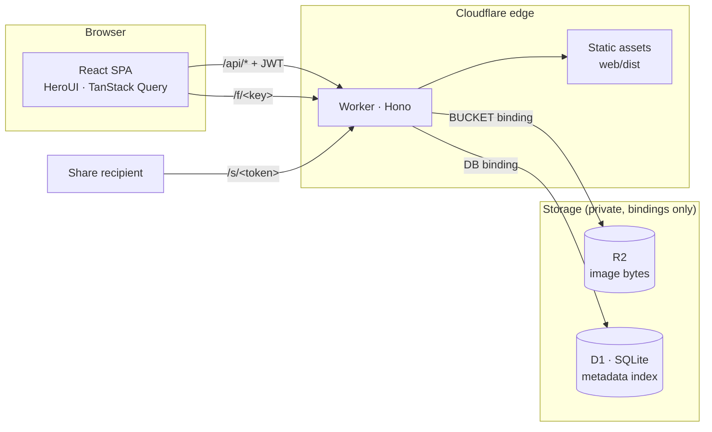

<h1 align="center">PicNest</h1>

<p align="center">
  Self-hosted image host on Cloudflare Workers + R2 + D1.<br>
  Your images, your domain, your storage — no third-party account, no ads, no link expiry.
</p>

<p align="center">
  <a href="LICENSE"></a>
  <a href="https://github.com/boltguo/PicNest/stargazers"></a>
  <a href="https://workers.cloudflare.com"></a>
</p>

<p align="center">English | <a href="README.zh-CN.md">简体中文</a></p>

<p align="center">
  <a href="https://deploy.workers.cloudflare.com/?url=https://github.com/boltguo/PicNest"></a>
</p>

## Features

- **Upload** — drag and drop, many files at once, progress per file
- **Organize** — folders, breadcrumbs, move between folders, six sort orders
- **Browse** — responsive grid, lightbox preview, file details
- **Direct links** — `/f/<key>`, cached for a year, paste anywhere
- **Share links** — optional expiry and password, visit counts, revocable
- **Deduplication** — identical images are stored once no matter how often you upload them
- **One password** — JWT session for 7 days, login throttled at the edge
- **Bilingual** — English and Chinese, public share pages included

## Deploy

### One click

Use the button at the top of this page. Cloudflare clones this repo into your
own GitHub account, creates the R2 bucket and D1 database for you, asks for an
admin password on the setup page, and deploys. Pushes to your copy redeploy
themselves from then on.

**Pick a long random password.** It is also the JWT signing key, so a guessable
password means forgeable sessions.

Two things to do in the dashboard afterwards:

- Attach your domain to the Worker.
- Leave the bucket private — no `r2.dev` subdomain, no custom domain on the
  bucket. Every byte should be served through the Worker.

### From your machine

```bash
npx wrangler r2 bucket create picnest
npx wrangler d1 create picnest   # paste database_id into wrangler.jsonc
pnpm secret                      # set ADMIN_PASSWORD
pnpm deploy                      # build + migrate + publish
```

## Local development

```bash
pnpm install
cp .dev.vars.example .dev.vars   # set ADMIN_PASSWORD
pnpm dev                         # worker :8787 + vite :5173
```

Open http://localhost:5173. Vite proxies `/api`, `/f/…` and `/s/…` to the
Worker; local D1 and R2 data live in `.wrangler/state/`.

```bash
pnpm typecheck                   # worker + web
pnpm db:generate                 # after editing worker/src/db/schema.ts
pnpm db:migrate:local            # apply the new migration locally
```

## How it works



One Worker serves everything: the React app as static assets, the JSON API, the
image bytes, and the server-rendered share pages. R2 holds the images and is the
source of truth; D1 holds names, folders and share links, and can be rebuilt
from R2 at any time with `POST /api/reconcile`.

Objects are keyed by the hash of their contents, which is what makes
deduplication free — upload the same photo into three folders and you get three
rows pointing at one object. Uploads are capped at 32 MB and must be images.

### Security

- Login is limited to 5 attempts per minute per IP, at the edge.
- The session is an HS256 JWT signed with `ADMIN_PASSWORD` — changing the
  password revokes every session.
- Share passwords are hashed in the browser; the plaintext never reaches the
  Worker.
- Stored bytes are served with `Content-Security-Policy: sandbox` and
  `nosniff`, so an uploaded SVG cannot script your origin.

## API

Authenticated endpoints take `Authorization: Bearer <jwt>`.

| Method | Path | Description | Auth |
| --- | --- | --- | --- |
| POST | `/api/login` | `{password}` → `{token}` | - |
| GET | `/api/list?folder=` | Folder contents + global stats | ✓ |
| PUT | `/api/upload?name=&folder=` | Raw bytes as body; dedups by content | ✓ |
| PATCH | `/api/file` | `{id, folder?, name?}` — move / rename | ✓ |
| DELETE | `/api/file?id=` | Delete one file | ✓ |
| GET | `/api/folders` | Every folder path | ✓ |
| POST | `/api/folder` | `{path}` — create (idempotent) | ✓ |
| DELETE | `/api/folder?path=` | Delete folder recursively | ✓ |
| POST | `/api/share` | `{id, hours?, password?}` → `{url, exp}` | ✓ |
| GET | `/api/shares` | Shares with visit counts | ✓ |
| DELETE | `/api/share?token=` | Revoke a share | ✓ |
| POST | `/api/reconcile` | Rebuild the D1 index from R2 | ✓ |
| GET | `/f/<key>` | Public direct link | - |
| GET | `/s/<token>` | Share access | - |

## Cost

Egress is free; operations are not. One image view that misses cache costs
1 Worker request + 1 R2 Class B operation.

| Item | Free tier |
| --- | --- |
| Storage | 10 GB |
| Class A (put / delete / list) | 1M / month |
| Class B (get / head) | 10M / month |
| Egress | Unlimited |
| Worker requests | 100k / day |

## Stack

| Layer | Choice |
| --- | --- |
| Runtime | Cloudflare Workers · R2 · D1 |
| Backend | [Hono](https://hono.dev) · [Drizzle ORM](https://orm.drizzle.team) · hono/jwt · zod · nanoid |
| Frontend | React 19 · React Router 7 · TypeScript · Vite |
| UI | [HeroUI v3](https://heroui.com) · Tailwind CSS 4 · lucide-react |
| Data layer | TanStack Query · axios · zustand |
| i18n | i18next + react-i18next |

## License

[Apache-2.0](LICENSE)
