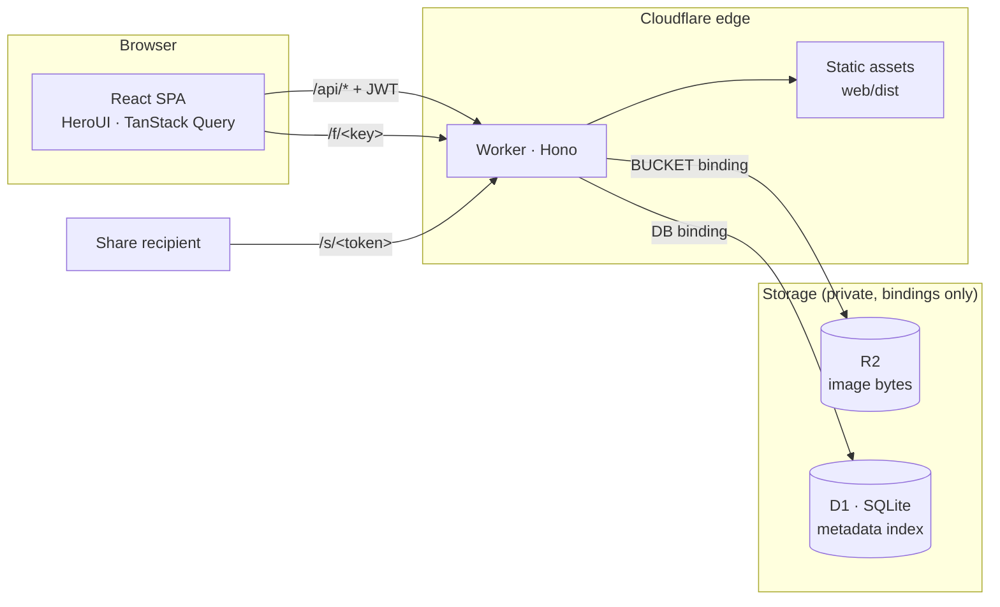

<h1 align="center">PicNest</h1>

<p align="center">
  Self-hosted image host on Cloudflare Workers + R2 + D1.<br>
  Your images, your domain, your storage — no third-party account, no ads, no link expiry.
</p>

<p align="center">
  <a href="LICENSE"></a>
  <a href="https://github.com/boltguo/PicNest/stargazers"></a>
  <a href="https://workers.cloudflare.com"></a>
</p>

<p align="center">English | <a href="README.zh-CN.md">简体中文</a></p>

<p align="center">
  <a href="https://deploy.workers.cloudflare.com/?url=https://github.com/boltguo/PicNest"></a>
</p>

## Features

- **Upload** — drag and drop, paste from the clipboard, progress per file
- **Organize** — folders, breadcrumbs, move and rename, six sort orders
- **Browse** — responsive grid, lightbox preview, file details
- **Direct links** — `/f/<key>`, permanent and public, paste anywhere
- **Share links** — optional expiry and password, visit counts, revocable
- **Deduplication** — identical images are stored once no matter how often you upload them
- **One password** — JWT session for 7 days, login throttled at the edge
- **Bilingual** — English and Chinese, public share pages included

JPEG, PNG, GIF, WebP and AVIF, up to 32 MB per file. The format is decided by
reading the file's own bytes, not by trusting what the browser said it was.

## Deploy

### One click

Use the button at the top of this page. Cloudflare clones this repo into your
own GitHub account, creates the R2 bucket and D1 database for you, asks for the
two secrets on the setup page, and deploys. Pushes to your copy redeploy
themselves from then on.

The setup page asks for both of these:

- `ADMIN_PASSWORD` — what you type to sign in. Pick a good one.
- `JWT_SECRET` — the key sessions are signed with. **Generate this, do not
  choose it**: `openssl rand -base64 32`. It is an HMAC key, and a memorable
  one turns any captured session token into an offline guessing game.

Two things to do in the dashboard afterwards:

- Attach your domain to the Worker.
- Leave the bucket private — no `r2.dev` subdomain, no custom domain on the
  bucket. Every byte should be served through the Worker.

### From your machine

```bash
npx wrangler r2 bucket create picnest
npx wrangler d1 create picnest   # paste database_id into wrangler.jsonc
pnpm secret                      # prompts for ADMIN_PASSWORD, generates JWT_SECRET
pnpm deploy                      # build + migrate + publish
```

## Local development

```bash
pnpm install
cp .dev.vars.example .dev.vars   # set ADMIN_PASSWORD and JWT_SECRET
pnpm dev                         # worker :8787 + vite :5173
```

Open http://localhost:5173. Vite proxies `/api`, `/f/…` and `/s/…` to the
Worker; local D1 and R2 data live in `.wrangler/state/`.

```bash
pnpm typecheck                   # worker + web
pnpm db:generate                 # after editing worker/src/db/schema.ts
pnpm db:migrate:local            # apply the new migration locally
```

## How it works



One Worker serves everything: the React app as static assets, the JSON API, the
image bytes, and the server-rendered share pages.

Objects are keyed by the SHA-256 of their contents, which is what makes
deduplication free — upload the same photo into three folders and you get three
rows pointing at one object.

### Backups

**R2 is the source of truth for bytes. D1 is the source of truth for
everything else** — names, folders, which logical files exist, and every share
link. A full backup is both halves; neither reconstructs the other.

`POST /api/repair` reconciles the two: objects with no row are imported, rows
whose object is gone are dropped. It is a consistency repair, **not** a
database restore. Each object carries only the name and folder it was *first*
uploaded with, so an import gets your images back under their original names
and cannot get back a rename, a move, the second folder a deduplicated image
was filed in, or any share link. For that, use
[D1 Time Travel](https://developers.cloudflare.com/d1/reference/time-travel/) —
7 days of point-in-time restore on the free plan, 30 on paid.

### Security

- Login is limited to 5 attempts per minute per IP, at the edge; entering a
  share password is limited to 10 per minute per IP and link.
- The session is an HS256 JWT signed with `JWT_SECRET`, which is random and
  separate from the admin password. Rotate it to sign every session out.
- Share passwords travel in a POST body, are stored as salted PBKDF2-SHA256,
  and buy a 15-minute signed `HttpOnly` cookie scoped to that one link.
  Nothing derived from the password ever appears in a URL.
- Uploads are accepted on their file signature, not their `Content-Type`.
  SVG is not an accepted format.
- Stored bytes are served with `Content-Security-Policy: sandbox` and
  `nosniff`; the dashboard and the share pages each ship a strict CSP.

`/f/<key>` is a **permanent public link**, by design. The key is the hash of
the image, so anyone who already has the same file can compute it — access
control lives on `/s/<token>`, never on `/f/`. The response asks browsers and
proxies to cache it for a year, which nothing can recall after a delete.

PicNest stores and serves your original bytes and does not strip EXIF. Photos
straight off a phone can carry camera and location metadata.

## API

Authenticated endpoints take `Authorization: Bearer <jwt>`.

| Method | Path | Description | Auth |
| --- | --- | --- | --- |
| POST | `/api/login` | `{password}` → `{token}` | - |
| GET | `/api/list?folder=` | Folder contents + global stats | ✓ |
| PUT | `/api/upload?name=&folder=` | Raw bytes as body; dedups by content | ✓ |
| PATCH | `/api/file` | `{id, folder?, name?}` — move / rename | ✓ |
| DELETE | `/api/file?id=` | Delete one file | ✓ |
| GET | `/api/folders` | Every folder path | ✓ |
| POST | `/api/folder` | `{path}` — create (idempotent) | ✓ |
| DELETE | `/api/folder?path=` | Delete folder recursively | ✓ |
| POST | `/api/share` | `{id, hours?, password?}` → `{url, exp}` | ✓ |
| GET | `/api/shares` | Live shares with visit counts | ✓ |
| DELETE | `/api/share?token=` | Revoke a share | ✓ |
| POST | `/api/repair` | Reconcile the D1 index against R2 | ✓ |
| GET | `/f/<key>` | Public direct link | - |
| GET | `/s/<token>` | Share access, or the password form | - |
| POST | `/s/<token>` | `password=` → unlock cookie, then redirect | - |

## Cost

Egress is free; operations are not. One image view that misses cache costs
1 Worker request + 1 R2 Class B operation.

| Item | Free tier |
| --- | --- |
| Storage | 10 GB |
| Class A (put / delete / list) | 1M / month |
| Class B (get / head) | 10M / month |
| Egress | Unlimited |
| Worker requests | 100k / day |

## Stack

| Layer | Choice |
| --- | --- |
| Runtime | Cloudflare Workers · R2 · D1 |
| Backend | [Hono](https://hono.dev) · [Drizzle ORM](https://orm.drizzle.team) · hono/jwt · zod · nanoid |
| Frontend | React 19 · React Router 7 · TypeScript · Vite |
| UI | [HeroUI v3](https://heroui.com) · Tailwind CSS 4 · lucide-react |
| Data layer | TanStack Query · axios · zustand |
| i18n | i18next + react-i18next |

## License

[Apache-2.0](LICENSE)
