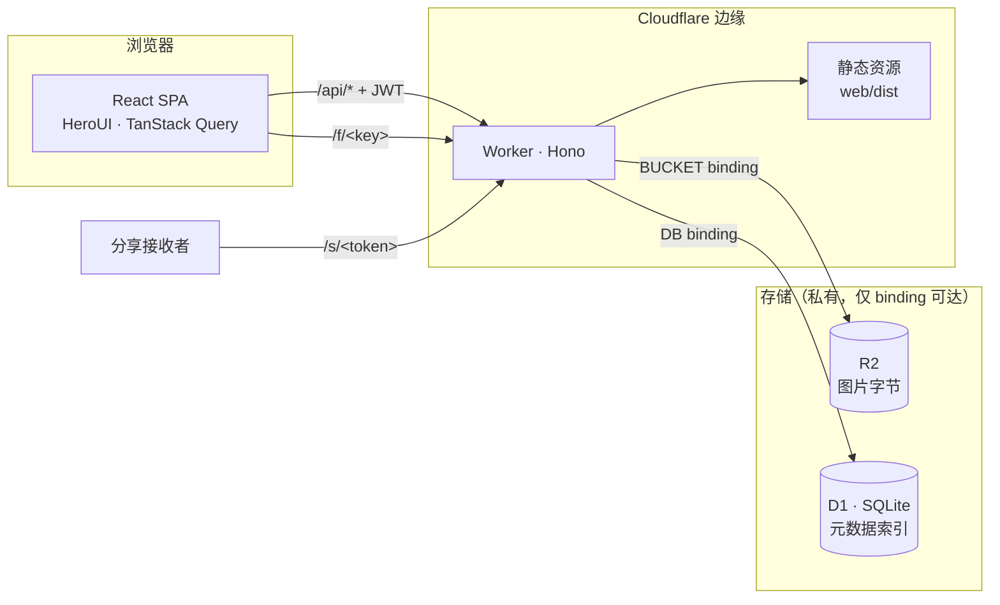
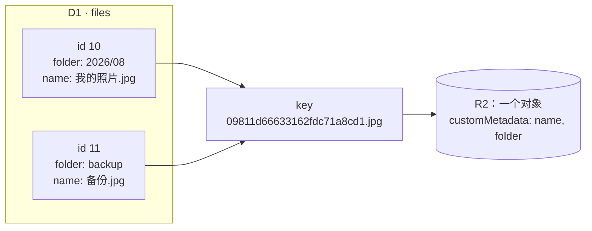
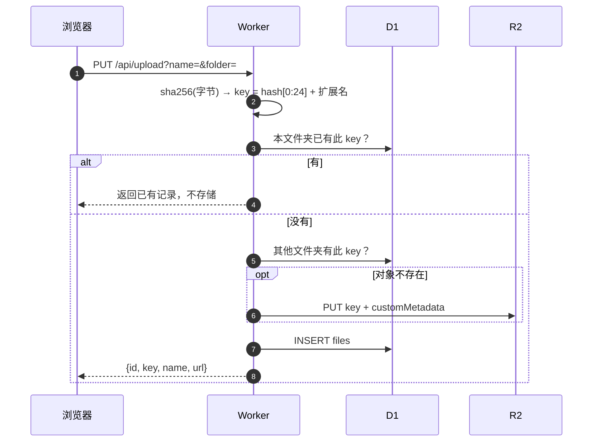
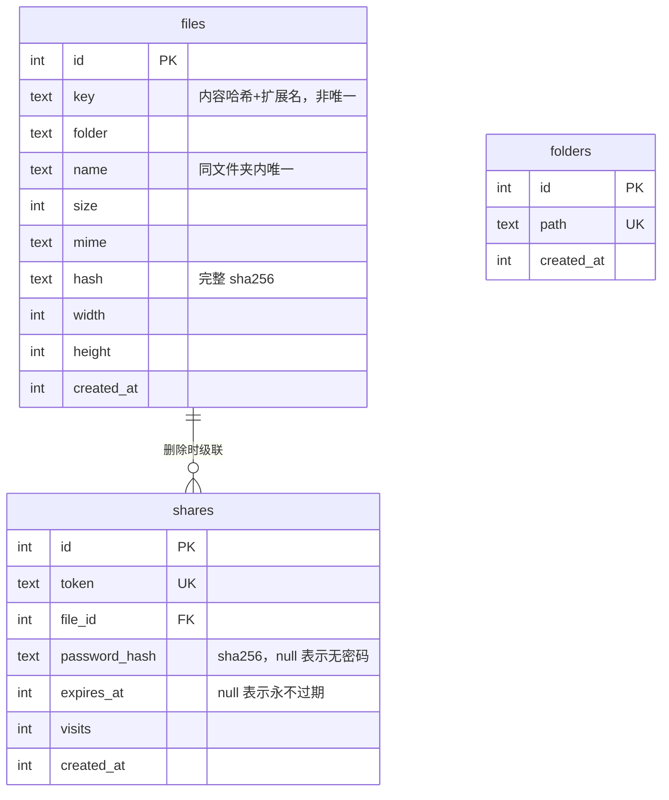

# PicNest

自建图床，跑在 Cloudflare Workers + R2 + D1 上。

[English](README.md)

## 功能

- 单用户密码登录（JWT，7 天）
- 文件夹管理、面包屑导航、移动、排序
- 拖拽上传，多文件并发，单文件进度
- 内容寻址存储，相同内容自动去重
- 网格浏览、灯箱预览、查看详情
- 公开直链（缓存一年）
- 分享链接：可设过期时间与访问密码，可查访问量、可撤销
- 中英文界面

## 快速开始

```bash
pnpm install
cp .dev.vars.example .dev.vars   # 设置 ADMIN_PASSWORD
pnpm dev                      # 本地 D1 迁移 + worker :8787 + vite :5173
```

打开 http://localhost:5173。Vite 把 `/api`、`/f/…`、`/s/…` 代理到 Worker。
本地 D1 与 R2 数据在 `.wrangler/state/`。

```bash
pnpm typecheck                # worker + web
pnpm build                    # 前端生产构建
```

## 部署

```bash
npx wrangler r2 bucket create picnest   # 创建桶
npx wrangler d1 create picnest          # 创建数据库，把 database_id 填进 wrangler.jsonc
pnpm db:migrate                      # 迁移到线上 D1
pnpm secret                          # 设置 ADMIN_PASSWORD
pnpm deploy                          # 构建前端 + 发布 Worker
```

域名绑在 Worker 上。桶保持私有：不开 `r2.dev` 子域，不绑自定义域名。

## 架构



R2 是唯一真相源，D1 是可重建的索引（`POST /api/reconcile`）。

`/api/*`、`/f/*`、`/s/*` 由 `assets.run_worker_first` 固定交给 Worker；
不加这项，浏览器导航会先被 SPA 兜底拦下，Worker 根本不执行。其余路径落到静态资源。

### 存储约定

| 项 | 规则 |
| --- | --- |
| R2 object key | `SHA-256(内容)[0:24] + 扩展名`，文件名不参与 |
| key 唯一性 | 非唯一。相同内容 = 一个对象，多条记录 |
| 行标识符 | `id`。`key` 不是 |
| 原始名称 / 文件夹 | 存 D1；同时写入 R2 `customMetadata` 供 reconcile 使用 |
| 同名冲突 | 同文件夹内追加 `-2`、`-3`（数据库唯一索引兜底） |
| 删除对象 | 引用计数归零才删（`deleteFileRows`） |
| 移动 / 重命名 | 仅 `UPDATE files`，不产生 R2 操作 |
| 下载文件名 | `Content-Disposition: inline` 带 `filename*=UTF-8''…` |
| 缓存 | `/f/` → `max-age=31536000, immutable`；`/s/` → `no-store` |
| 允许类型 | 仅 `image/*`，其余返回 415 |
| 单文件上限 | 32 MB，超出返回 413 |
| 对象响应头 | `Content-Security-Policy: sandbox` + `X-Content-Type-Options: nosniff`，SVG 无法在本站域下执行脚本 |
| 桶可见性 | 私有，仅 binding 可达 |



### 上传流程



先写 R2 后写 D1。中间失败留下未索引的对象，由 reconcile 认领。

### 数据模型



分享页服务端渲染，按 `Accept-Language` 本地化。

### 安全

| 面 | 措施 |
| --- | --- |
| 登录 | 每 IP 每 60 秒 5 次，用 Workers 官方限速 binding |
| 会话 | HS256 JWT，7 天。签名密钥就是 `ADMIN_PASSWORD`，改密码即吊销全部会话 |
| 分享密码 | 浏览器内哈希成 SHA-256，明文不到达 Worker |

`ADMIN_PASSWORD` 同时是 JWT 密钥，请用长随机串 —— 弱密码等于弱 HMAC 密钥。

### 计费

流量免费，操作计费，binding 不豁免。一次未命中缓存的看图 = 1 次 Worker 请求 + 1 次 R2 Class B。

| 项 | 免费额度 |
| --- | --- |
| 存储 | 10 GB |
| Class A（put / delete / list） | 100 万 / 月 |
| Class B（get / head） | 1000 万 / 月 |
| 出站流量 | 无限 |
| Worker 请求 | 免费版 10 万 / 天；付费版 1000 万 / 月 |

## 技术栈

| 层 | 选型 |
| --- | --- |
| 运行时 | Cloudflare Workers · R2 · D1 |
| 后端 | [Hono](https://hono.dev) · [Drizzle ORM](https://orm.drizzle.team) · hono/jwt · zod + @hono/zod-validator · nanoid |
| 前端 | React 19 · React Router 7 · TypeScript · Vite |
| UI | [HeroUI v3](https://heroui.com) · Tailwind CSS 4 · lucide-react |
| 数据层 | TanStack Query · axios · zustand persist |
| 国际化 | i18next + react-i18next |
| 表单 | react-hook-form + zod |

## 目录结构

```
picnest/
├── wrangler.jsonc           # Worker 配置（R2 + D1 binding、登录限速、SPA 资源）
├── pnpm-workspace.yaml      # 工作区根，唯一子包是 web
├── migrations/              # drizzle-kit 生成的 SQL 迁移
├── drizzle.config.ts
├── worker/src/
│   ├── index.ts             # 应用组装、404/错误兜底
│   ├── config.ts            # 常量
│   ├── types.ts             # Bindings 类型
│   ├── db/                  # Drizzle schema + client
│   ├── lib/                 # auth · files（引用计数删除）· paths · r2 · hash · locale
│   ├── routes/              # auth / files / folders / shares / system
│   └── templates/           # 服务端渲染的分享页
├── web/public/logo.svg      # 应用标识，同时用作 favicon 和分享页图标
└── web/src/
    ├── main.tsx             # Router / QueryClient / i18n / Toast 组装
    ├── i18n/                # i18next 配置 + en/zh 文案
    ├── pages/               # LoginPage · DashboardPage
    ├── components/          # Dropzone · FileCard · FolderCard · Breadcrumb · 各类弹窗
    ├── hooks/               # useUploads 上传队列
    ├── lib/                 # axios 客户端 · 工具函数
    └── store/               # zustand auth / prefs
```

## API

鉴权接口需带 `Authorization: Bearer <jwt>`。文件用 `id` 定位。

| 方法 | 路径 | 说明 | 鉴权 |
| --- | --- | --- | --- |
| POST | `/api/login` | `{password}` → `{token}` | - |
| GET | `/api/list?folder=` | 文件夹内容 + 全局统计 | ✓ |
| PUT | `/api/upload?name=&folder=` | 请求体为原始字节，按内容去重 | ✓ |
| PATCH | `/api/file` | `{id, folder?, name?}` — 移动 / 重命名 | ✓ |
| DELETE | `/api/file?id=` | 删除单个文件（引用计数） | ✓ |
| GET | `/api/folders` | 所有文件夹路径 | ✓ |
| POST | `/api/folder` | `{path}` — 创建（幂等） | ✓ |
| DELETE | `/api/folder?path=` | 递归删除文件夹 | ✓ |
| POST | `/api/share` | `{id, hours?, password?}` → `{url, exp}` | ✓ |
| GET | `/api/shares` | 分享列表（含访问量） | ✓ |
| DELETE | `/api/share?token=` | 撤销分享 | ✓ |
| POST | `/api/reconcile` | 从 R2 重建 D1 索引 | ✓ |
| GET | `/f/<key>` | 公开直链 | - |
| GET | `/s/<token>` | 分享访问 | - |

## 数据库变更

```bash
# 改 worker/src/db/schema.ts 后
pnpm db:generate              # 生成 SQL 迁移
pnpm db:migrate:local         # 应用到本地
pnpm db:migrate               # 应用到线上
```

`migrations/meta/` 是 drizzle-kit 的账本：`_journal.json` 是迁移清单，
`0000_snapshot.json` 是 diff 基线。Wrangler 不读该目录，用 D1 的 `d1_migrations` 表记录执行状态。

## 路线图

- [ ] 图片压缩 / 缩略图（保留 `_` key 前缀）
- [ ] 上传时写入图片宽高（字段已存在）
- [ ] 文件夹移动与重命名
- [ ] 批量选择

## 许可证

[Apache-2.0](LICENSE)
