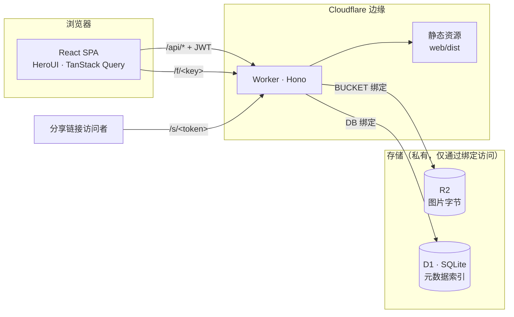

<h1 align="center">PicNest</h1>

<p align="center">
  自建图床，跑在 Cloudflare Workers + R2 + D1 上。<br>
  图片是你的，域名是你的，存储也是你的 —— 不用注册第三方账号，没有广告，链接不会过期。
</p>

<p align="center">
  <a href="LICENSE"></a>
  <a href="https://github.com/boltguo/PicNest/stargazers"></a>
  <a href="https://workers.cloudflare.com"></a>
</p>

<p align="center"><a href="README.md">English</a> | 简体中文</p>

<p align="center">
  <a href="https://deploy.workers.cloudflare.com/?url=https://github.com/boltguo/PicNest"></a>
</p>

## 功能

- **上传** —— 拖拽、剪贴板粘贴、多文件并发、单文件进度
- **整理** —— 文件夹、面包屑导航、移动与重命名、六种排序
- **浏览** —— 自适应网格、灯箱预览、查看详情
- **直链** —— `/f/<key>`，永久公开，随便往哪贴
- **分享链接** —— 可设过期时间与访问密码，可查访问量、可撤销
- **自动去重** —— 内容相同的图片只存一份，上传多少次都一样
- **一个密码** —— JWT 会话 7 天，登录在边缘限流
- **中英双语** —— 包括对外的分享页

支持 JPEG、PNG、GIF、WebP、AVIF，单文件最大 32 MB。格式由文件自身的字节判定，不采信
浏览器声明的 `Content-Type`。

## 部署

### 一键部署

点页面顶部那个按钮。Cloudflare 会把这个仓库克隆到你自己的 GitHub 账号下，替你创建
R2 桶和 D1 数据库，在设置页问你要两个密钥，然后部署。之后往你那份仓库推代码就会
自动重新部署。

设置页要填的是这两个：

- `ADMIN_PASSWORD` —— 你登录时输入的密码，挑个好的。
- `JWT_SECRET` —— 会话的签名密钥。**这个要生成，不要自己想**：
  `openssl rand -base64 32`。它是 HMAC 密钥，用一个记得住的字符串当密钥，等于
  任何一个被截获的会话令牌都能拿去离线穷举。

部署完在面板里还有两件事要做：

- 把域名绑到 Worker 上。
- 桶保持私有 —— 不开 `r2.dev` 子域，不给桶绑自定义域名。所有字节都应该经 Worker 出去。

### 在本机部署

```bash
npx wrangler r2 bucket create picnest
npx wrangler d1 create picnest   # 把 database_id 填进 wrangler.jsonc
pnpm secret                      # 询问 ADMIN_PASSWORD，自动生成 JWT_SECRET
pnpm deploy                      # 构建 + 迁移 + 发布
```

## 本地开发

```bash
pnpm install
cp .dev.vars.example .dev.vars   # 设置 ADMIN_PASSWORD 和 JWT_SECRET
pnpm dev                         # worker :8787 + vite :5173
```

打开 http://localhost:5173。Vite 把 `/api`、`/f/…`、`/s/…` 代理到 Worker；
本地 D1 与 R2 数据在 `.wrangler/state/`。

```bash
pnpm typecheck                   # worker + web
pnpm db:generate                 # 改完 worker/src/db/schema.ts 之后
pnpm db:migrate:local            # 把新迁移应用到本地
```

## 工作原理



一个 Worker 扛下全部：React 应用作为静态资源、JSON API、图片字节，以及服务端渲染的
分享页。

对象以内容的 SHA-256 为 key，去重因此是免费的 —— 同一张照片传进三个文件夹，得到的是
三条记录指向同一个对象。

### 备份

**R2 是图片字节的事实来源，D1 是其余一切的事实来源** —— 名称、文件夹、有哪些逻辑文件，
以及全部分享链接。完整备份是两边加起来，任何一边都推不出另一边。

`POST /api/repair` 做的是两边对账：R2 里有对象但没有记录的导入，有记录但对象已经没了的
删掉。它是一致性修复，**不是**数据库恢复。每个对象只带着它第一次上传时的名称和文件夹，
所以导入能把图片按原名找回来，但找不回重命名、移动、去重图片被归到的第二个文件夹，以及
任何分享链接。那些要靠
[D1 Time Travel](https://developers.cloudflare.com/d1/reference/time-travel/) 恢复到
某个时间点 —— 免费计划 7 天，付费计划 30 天。

### 安全

- 登录限流：每 IP 每分钟 5 次，在边缘拦；输入分享密码限流：每 IP 每条链接每分钟 10 次。
- 会话是用 `JWT_SECRET` 签名的 HS256 JWT，这个密钥是随机的，和管理密码分开。
  轮换它就等于把所有会话踢下线。
- 分享密码走 POST body 传输，存的是加盐的 PBKDF2-SHA256，验证通过后换到一个 15 分钟的
  签名 `HttpOnly` Cookie，且只对那一条链接有效。URL 里不会出现任何由密码推导出来的东西。
- 上传按文件签名判定格式，不看 `Content-Type`。SVG 不在支持的格式里。
- 存储的字节带 `Content-Security-Policy: sandbox` 和 `nosniff` 返回；管理页和分享页
  各自还有一套严格的 CSP。

`/f/<key>` 按设计就是**永久公开链接**。key 是图片的哈希，手上有同一张图的人自己就能算出
来 —— 访问控制在 `/s/<token>` 上，不在 `/f/` 上。这个响应会让浏览器和中间缓存留一年，
删除之后已经缓存的副本收不回来。

PicNest 原样存储、原样返回你的字节，不会清除 EXIF。手机直出的照片可能带着设备型号和
拍摄位置。

## API

需要鉴权的接口带 `Authorization: Bearer <jwt>`。

| 方法 | 路径 | 说明 | 鉴权 |
| --- | --- | --- | --- |
| POST | `/api/login` | `{password}` → `{token}` | - |
| GET | `/api/list?folder=` | 文件夹内容 + 全局统计 | ✓ |
| PUT | `/api/upload?name=&folder=` | body 为原始字节，按内容去重 | ✓ |
| PATCH | `/api/file` | `{id, folder?, name?}` —— 移动 / 重命名 | ✓ |
| DELETE | `/api/file?id=` | 删除单个文件 | ✓ |
| GET | `/api/folders` | 所有文件夹路径 | ✓ |
| POST | `/api/folder` | `{path}` —— 创建（幂等） | ✓ |
| DELETE | `/api/folder?path=` | 递归删除文件夹 | ✓ |
| POST | `/api/share` | `{id, hours?, password?}` → `{url, exp}` | ✓ |
| GET | `/api/shares` | 有效的分享列表与访问量 | ✓ |
| DELETE | `/api/share?token=` | 撤销分享 | ✓ |
| POST | `/api/repair` | D1 索引与 R2 对账修复 | ✓ |
| GET | `/f/<key>` | 公开直链 | - |
| GET | `/s/<token>` | 访问分享，或密码表单 | - |
| POST | `/s/<token>` | `password=` → 解锁 Cookie，然后重定向 | - |

## 费用

出网流量免费，操作次数不免费。一次未命中缓存的图片浏览 = 1 次 Worker 请求 + 1 次
R2 Class B 操作。

| 项目 | 免费额度 |
| --- | --- |
| 存储 | 10 GB |
| Class A（put / delete / list） | 100 万 / 月 |
| Class B（get / head） | 1000 万 / 月 |
| 出网流量 | 无限 |
| Worker 请求 | 10 万 / 天 |

## 技术栈

| 层 | 选型 |
| --- | --- |
| 运行时 | Cloudflare Workers · R2 · D1 |
| 后端 | [Hono](https://hono.dev) · [Drizzle ORM](https://orm.drizzle.team) · hono/jwt · zod · nanoid |
| 前端 | React 19 · React Router 7 · TypeScript · Vite |
| UI | [HeroUI v3](https://heroui.com) · Tailwind CSS 4 · lucide-react |
| 数据层 | TanStack Query · axios · zustand |
| 国际化 | i18next + react-i18next |

## 许可

[Apache-2.0](LICENSE)
